[TOC]

github的目录：

1.音变2.语法2.1时态2.2虚拟语气3.单词1.1 真题单词摘抄1.2 近似词辨析4.短语5.句子日常用句单词组句6.每天的单词7.马思瑞的口语

[1.音变](#1.音变).

[2.语法](#2.语法).

[3.单词](#3.单词).

[4.短语](#4.短语).

[5.句子](#5.句子).

[6.每天的单词](#6.每天的单词).

[7.马思瑞的口语](#7.马思瑞的口语).

# 1.音变

音变主要有连读、失音、弱化、浊化、同化、重音、缩度等形式。这些形式的产生可以归结为一个原则，即“Economy”——“经济”原则，或称为“省力”原则。 

 

**1.连读**

(1) 词尾辅音 + 词首元音

My name is.....

Take a look at it.....

Not at all.

Can I help you?

Time is up.

Good idea

Take it easy.

Finish it in a minute if it is not difficult.

Try to finish the job as soon as possible.

(2) 词尾元音 + 词首元音

Thank you for coming to see me off

I hope you will enjoy it

Hurry up

Don’t worry about it

I can do it

Go on with your work

How often do you swim?

How about seeing a film this evening

**2.失去爆破**

词尾爆破音（b p t g k ) + 词首爆破音（b p t g k )

Have a good time.

A big cake

Take care

Please sit down

What do you mean

Ask bob to sit behind me

No need to finish it now.

A good cook could cook as many cookies as a good cook who could cook cookies

**3.不完全爆破**

(1 )词尾摩擦音 + 摩擦音

I need some more money

What would you advise me to do?

You must pay in advance

(2) 词尾爆破音 + 爆破音

That joke

You shouldn’t treat women like object

Can I take a picture with you?

**4.** **浊化**

 (1) 元音 + 清辅音 + 元音

City letter water pretty citizen.

The sooner, the better

I think you’d better see a doctor

Your story just doesn’t hold water

What’s the matter with you?

Stay out of this matter

(2) 元音 + T + L

I have a little problem

(3) 连读后的浊化

I’ll think about it

Can I have a look at it

Not all

Say it again

**5.同化**

第一大规律：相互同化

(1) t + j →t

Nice to meet you

I know a lot about you

I know you can speak good english

Take care that you dont spoil your new clothes

How about you

(2) d+j-

Could you tell me where the bus stop is

Did you finish your homework yesterday

Would you show me the bathroom

(3)s+j-

God bless you

Baby i miss you everyday

Now look what a mess you have done

(4)z+j-

How is your boyfriend

Hows your family

第二大规律：顺向同化

（1）名词变复数：i want to buy a lot of english books

（2）动词变第三人称单数：she works in zaidong education

（3）动词变过去式或过去分词;she looked very blue yesterday

（4）T+s :all of the students stop reading

（5）D+s:my friends in america send me a message that the economic forecast is pleasant there

第三大规律：逆向同化

（1）before i eat dinner,  i read the newspaper for a while

（2）He is not the man he used to be

（3）Dont worry , you get used to it in no time

（4）You have to get off here

（5）That is all he has to do

（6）I had to go and talk with jim

**6,** **异化**

1), sp+元音：how do you spend your leisure time

Action speak louder than words

2), sk+元音:im so scared

If i were a millionaire i would start a school

3) st+元音 if you are ready, you may start your work

Would you like some steak?

4) str+元音:the work is still strange to him

He struck me with a stick

**7,** **缩读**

(1) want to ----wanna what do you wanna do

(2) Be going to -----be gonna im gonna study abroad

(3) Have got to --gotta i gotta see you

(4)Because ----cause i broke up with my boyfriend cause i dont like him

(5)Give me ----gimme gimme that book

(6)Out of -----outta get outta here

(7)You ---ya how are ya

(8)Are you -- where are you going

(9)And ---n youn me rockn roll

(10)What is the ---whatsa whatsa matter

(11)Old ---ol look at that olman

(12)Sure--sher are you sher

(13)Goodbye----gbye im leaving gbye

(14)What are you wachya/wacha wachya doing here

(15)Ing---in we are talikin about the education in china

(16)Let me -- lemme give you an example

**8,** **略读**

第一大规律：词尾的爆破

Very good

Im a student

Never give up

第二大规律：意群结尾的爆破音

I could cause i believe i could

Mike likes to write by the nice bright light at night I think you shouldnt push him too hard

**9,** **被击穿的H音**

（1）him--im dont tell im

（2）Her--er please call er

实例操作

Hey jude

**10,** **弱读**

弱读三大规律：

第一大规律：把元音弱化为

Ladies and gentlemen

You and me

I have an english teacher

I’ll be back in half an hour

My wife and i are very happy

第二大规律：弱化为同类音长音---短音

Me give me a sec to change film

We why don’t we go out for a walk

She she has an accent

第三大规律：弱到不发音

Difficult

Intention

**11,** **鼻腔爆破** **Good night**

Good morning

Let me help you

Her goodness was apparent to everyone I’m a student

**12,** **舌边爆破**

I have been very busy lately

Where have you been lately

I met the old lady in the shop

He slept badly

His foot was badly hurt

**13,** **同类音消失**

What does the man mean

This shop is so romantic

How was the party last night

These clothes are so beautiful

**14, t音的消失（杀手音n）**

Internet i enjoy surfing on the internet

Twenty i take 20 thousand dollars with me International be an International chinese

**15, r音的连读、**

For example

My friend comes from a country far away I will keep my promise forever

There is ten minutes left

There are over 600,000 kinds of insects in the world

**16,** **辅音连缀**

S+m he’s a smart businessman

S+n his shirt is as white as snow

S+l did you sleep well

S+w no sweet without sweat

P+l what’s your plan for the future

P+r the price of that house is high

G+l i am very glad that you could come

S+p+r the rumor quickly spread through

S+t+r he was a strict farther

**17,** **情态动词完成时过去将来时缩写**

Could have ----could’a tom could’a finished homework

Must have------must’a i must’a very strange experience

Should have ----should’a i should have done it

Would have -----would’a they would’a come to the meeting if he had known about it

**18, of不规则缩读**

Kind of ---kinda that is one kind battle in this war

A lot of ---a lotta this week we are getting a lotta brand new information

Lots of --lotsa they all contain lotsa water

Sort of----sorta i sorta like’m

Bunch of ----buncha the intent is for a buncha lawyers to make money

Because of --becausea it’s because of that theoretical possibility that some people think it may be better to change

 

# 2.语法

## 2.1时态

纵轴我们可以分为四个时间段：现在，过去，将来，过去将来；横轴可以分为四个状态：一般，进行，完成，完成进行；这便是时和态，一起构成了英语中的16种时态；

- **动词的十二类时态**

我们将三类时间和四类状态组合，可得到下表所示的十二类时态。

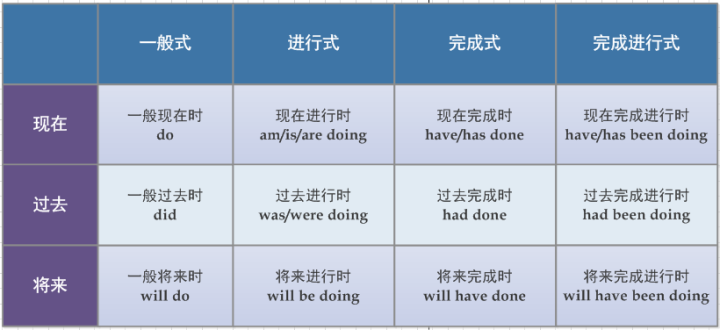

接下来将分别介绍这十二类时态的用法，介绍的顺序为：一般式、进行式、完成式、完成进行式。

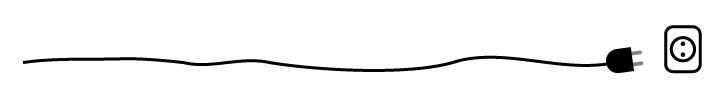

- **一般式**

**一般式常用来表示经常发生的动作**。

**1. 一般现在时（do）**

除了表示经常发生的动作外，一般现在时还可以用来表示客观事实。

> Light **travels** more quickly than sound. 
> （光传播的速度比声音快。）

**2. 一般过去时（did）**

一般过去时表示某个过去的时间点所发生的动作。

> ① I **used** the pen before. 
> （我之前用过这支笔。）

将句①表述到时间轴中，我们用 **“空心圆点”** 来表示一般式，如下图所示：

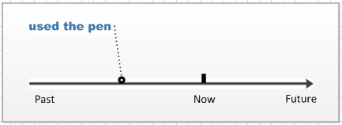

上图表示“use the pen”这个动作发生在过去的某个时间点。

**3. 一般将来时（will do）**

一般将来时表示某个将来的时间点会发生的动作。

> ② Phoebe **will live** in a modern city. 
> （Phoebe将在大城市生活。）

将句②表述到时间轴中，得到：

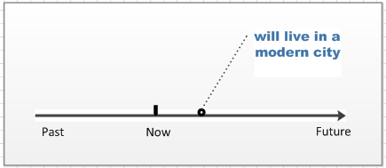

上图表示“live in a modern city”这个动作会发生在某个将来的时间点。

- **进行式**

**进行式用来表示某个时刻或时间段正在进行的动作**。

**4. 现在进行时（am/is/are doing）**

现在进行时表示现在正在进行的动作。

> ③ I **am playing** tennis now. 
> （我正在打网球。）

将句③表述到时间轴中，由于“正在进行的动作”必定会延续一段时间，所以我们用**“灰色矩形”**来表示进行时，如下图：

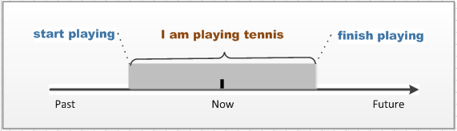

由上图所示，现在（now）这个时间点正处于表示“I am playing tennis”的灰色矩形里面，所以我们可以说“I am playing tennis now”。

**5. 过去进行时（was/were doing）**

过去进行时表示在某个过去的时间点或时间段正在进行的动作。

> ④ They **were watching** TV when a stranger suddenly rushed in. 
> （当一个陌生人突然冲进来的时候，他们正在看电视。）

将句④表述到时间轴中，我们同样用**“灰色矩形”**来表示此时态：

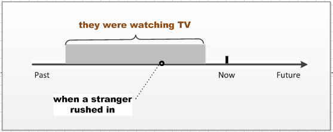

由上图所示，我们用空心圆点表示“a stranger suddenly rushed in”这个过去时间点，其正处于表示“they were watching TV”的灰色矩形里面，两者组合便得到了句④。

**6. 将来进行时（will be doing）**

将来进行时表示在某个将来的时间点或时间段正在进行的动作，这类动作一般是事先计划好的，而且一定会发生的。

> ⑤ We **will be flying** at 30 000 feet in five minutes. 
> （五分钟后，我们就会翱翔在三万英尺的高空了。）

将句⑤表述到时间轴中，可以得到：

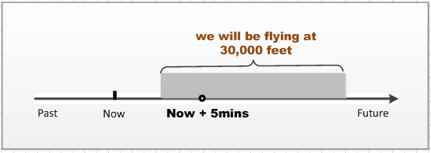

由上图所示，我们用空心圆点表示“in five minutes”这个将来时间点，其正处于表示“We will be flying at 30 000 feet”的灰色矩形里面，两者组合便得到了句⑤。

- **完成式**

**完成式表示：站在某一时间点，对这个时间点之前发生的动作做一个总结。**

**7. 现在完成时（have/has done）**

现在完成时表示处于现在这个时间点，对这个时间点之前发生的一个或一系列动作的总结。

> ⑥ I **have used** the pen only three times. 
> （这支笔我只用过三次。）

将句⑥表述到时间轴中，因为完成式是对之前发生事情的一个总结，所以我们用**“向左的方括号”**来表示完成式，表示**“至此为止，之前发生的一系列动作是这样的结果”**。

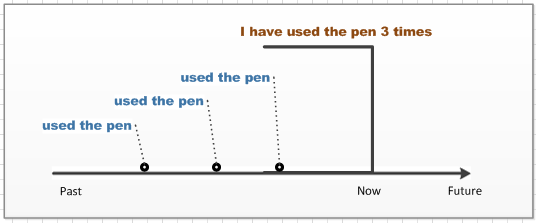

由上图所示，因为“use the pen”这个动作在过去发生了三次，所以我们处于现在（now）这个时间点来总结这三个动作，于是便得到了“I have used the pen only three times”的结论。

**8. 过去完成时（had done）**

过去完成时表示站在某个过去的时间点，对这个时间点之前发生的一个或一系列动作的总结。

> ⑦ When they reached there, the ship **had set** off. 
> （当他们到达那里的时候，船已经开了。）

将句⑦表述到时间轴中，我们同样用**“向左的方括号”**表示该时态：

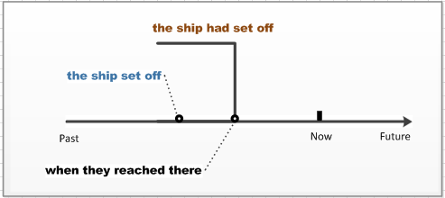

由上图所示，该句相当于站在“they reached there”这个过去的时间点，对这个时间点之前发生的动作“the ship set off”做一个总结，于是便得到了“the ship had set off”的结论。

**9. 将来完成时（will have done）**

将来完成时表示站在某个将来的时间点，对这个时间点之前的一个或一系列动作的总结。

> ⑧ By July, Michael **will have got** two college degrees. 
> （到七月份，Michael就已经拿到两个大学学位了。）

将句⑧表述到时间轴中，得到：

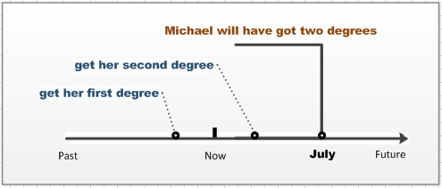

站在现在（now）这个时间点来看，或许Michael已经拿到了两个学位、或许她拿到了一个学位、也或许她还一个学位都没有拿到。其实都不重要，重要的是将来完成时所总结的内容：“到七月份，她就已经拿到两个大学学位了。”

特别需要注意的是，完成时态都是站在某个时间点，对这个时间点之前发生的动作做一个总结。所以，如果句子的上下文中没有明确的表示出这个时间点，就不能使用完成式。例如：

> The ship had set off. （×） 
> Michael will have got two college degrees. （×）

- **完成进行式**

**完成进行式是完成式与进行式的结合，表示对一个正在进行的动作的总结。**

**10. 现在完成进行时（have/has been doing）**

现在完成进行时表示对一个现在正在进行动作的总结。例如：

> ⑨ Tom **has been playing** football for two hours.
>  （Tom已经踢了两个小时的足球了。）

将句⑨表述到时间轴中，用**“灰色矩形”**来表示进行时，而用**“向左的方括号”**来表示完成时，可以得到：

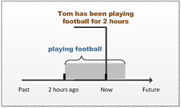

如上图所示，我们站在现在（now）这个时间点，对当时正在进行的动 作“playing football”展开总结，于是得到了“Tom has been playing football for two hours”的结论。

**11. 过去完成进行时（had been doing）**

过去完成进行时表示站在某个过去的时间点，对这个时间点正在进行动作的总结。

> ⑩ I **had been cleaning** my room the whole morning when she came. 
> （当他来的时候，我已经打扫了一早上的房间了。)

将句⑩表述到时间轴中，得到：

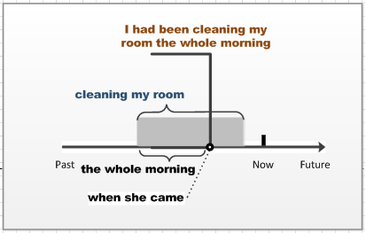

如上图所示，我们站在“when she came”这个过去的时间点，并对这个时间点正在进行的动作“cleaning my room”做一个总结，于是就得到了“I had been cleaning my room the whole morning”的结论。

**12. 将来完成进行时（will have been doing）**

将来完成进行时表示站在某个将来的时间点，对这个时间点正在进行动作的总结。

> ⑪ I **will have been doing** the drawing for five hour at 11 pm. 
> （到晚上11点，我就连续画图五个小时了。）

将句⑪表述到时间轴中，得到：

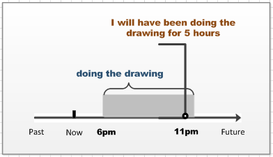

如上图所示，我们站在一个将来时间点11 pm，对这个时间点正在进行的动作“doing the drawing”做一个总结，于是就得到了“I will have been doing the drawing for five hour”的结论。

- **过去将来时**

至此为止，我们学习了共十二类时态的用法。

实际上，动词还能够表示另一类时间（**过去将来**），这类时间对应的是下表所示的四类时态——即一般过去将来时、过去将来进行时、过去将来完成时、过去将来完成进行时。

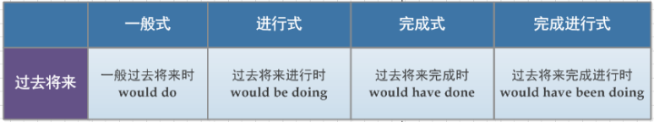

那为什么将这类时态提出来单独介绍呢？

**因为这类时态的用法与将来时的用法基本完全相同。**唯一不同的地方是：**将来时**表示的是从现在（now）这个时间点看将来要发生的动作，而**过去将来时**表示从过去（past）的某个时间点看将来要发生的动作。如下图所示：

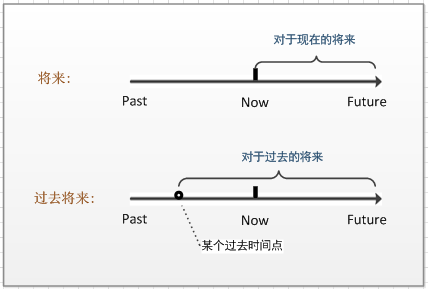

所以，**对于过去的将来 = 某个过去时间点到现在的这段时间 + 对于现在的将来**。

**13. 一般过去将来时（would do）**

一般过去将来时表示：站在某个过去的时间点看将会发生的动作。

> ⑫ He told me that he **would go** abroad. 
> （他之前告诉我他会出国。）

将句⑫表述到时间轴中，得到：

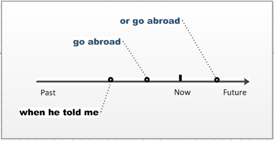

从时间轴上看，这个动作可能发生在“when he told me”至现在（now）这一段区域，也有可能发生在now之后的那一段区域。也就是说，对于now这个时间点来说，“go abroad”可能已经发生了，也可能将来才会发生。

大家可以发现，**过去将来时**和**将来时**两者表现在时间轴中是极其相似的，所以剩下的三种时态就只给出例句，就不画图了。（也实在是画不动了……）

**14. 过去将来进行时（would be doing）**

过去将来进行时表示：站在某个过去的时间点，从这个时间点看一个之后的时间点（或时间段）正在发生的动作。

> He knew that I **would be living** in China next month. 
> （他就知道我接下来一个月就会在中国生活了。）

**15. 过去将来完成时（would have done）**

过去将来完成时表示：站在某个过去的时间点，对一个之后的时间点已经发生了的动作做总结。

> He said he **would have left** for London by the end of next month. 
> （他说第二个月末她肯定已经动身去伦敦了。）

**16. 过去将来完成进行时（would have been doing）**

过去将来完成时表示：站在过去的某个时间点，对一个之后的时间点正在发生的动作做总结。

> I knew by July he **would have been working** there for 30 years. 
> （我知道到七月他就在那里工作整整30年了。）

## 2.2虚拟语气

**虚拟语气**是一种表示假设状态的句型，是一种特殊的动词形式；表示所说的话不是一个事实，而只是说话者的一种假设，主观愿望，建议，猜测或不大可能实现的空想。

虚拟语气用在条件状语从句中：

|      | 从句     | 主句            |
| ---- | -------- | --------------- |
| 现在 | did/were | would do        |
| 过去 | had done | would have done |
| 将来 | should   | would do        |

> Would 代表 should、could、might、ought to等助动词的过去式；

例句：

- If he **studied** harder，he **might pass** the exam.
- If he **had had** money that time，he would have bought a car.
- If it **should** rain，the game would be put off.       (if ... should 万一)

注意： 

-  **表示与真理相反的虚拟语气的结构**

  if + 主语 + were to do，主语 + should/would/could/might/ought to do

  例：

  真理：The sun dose't rise in the west

  假设：If the sun were to rise in the west，how surprised people would be（如果太阳从西边升起，人们会多么吃惊啊）

-  在虚拟语气的if从句中**had、should、were**出现时，可将这三个词提前，将if省略

  例：

  should it rain（if it should rain），the game would be put off.

  Had he done it（if he had done it），he would have felt sorry.

对下面的总结：只要由下面引导词引导的句子，都用上面的`if从句`中的时态；

**wish + 宾语从句**

-  与现在事实相反
  - wish he **were** here.
  - I wish I **knew** everything in the world.

- 与过去事实相反
  - I wish (that) she **had been** here.（我真希望她当时就在这里）
  - I wish that I could **have gone** with you last night.

**if only用于与现在或过去相反的虚拟语气中**，情况同上；

- 与现在事实相反：If only he **were** here（他现在要是在就好了）
- 与过去事实相反：If only I **had known** it earlier（我要是早知道就好了）

**I would rather/sooner 后用与现在或过去相反的虚拟语气**

在would rather,would sooner后的that从句中,句子谓语习惯上要用虚拟语气，表示"**宁愿做什么**"

- I'd rather you **came** next Saturday.（我希望你下周来，表示与现在相反）
- I would rather (that) I **had studied** harder when I was young.（我真希望年轻的时候多努力学习）

**as if / as though / even if / even though同上**

- Mr. Wangle loves me as if I **were** his own child（王先生爱我就像我是他的孩子一样，与现在事实相反）
- The old worker works as though he **were** a young man.（这个老员工工作起来就像个年轻人）
- Even if he **were** here himself，he should not know what to do（即使他亲自来他也不知道做什么）

本篇虚拟语气文章的[其他内容](https://baijiahao.baidu.com/s?id=1611118961932644701&wfr=spider&for=pc).

# 3.单词

#### 1.1 真题单词摘抄

conduct                                                                  v实施.执行

conduct an activity                                           组织一场活动

seek-sought                                                            寻找

kin                                                                        亲人

furthermore                                                            此外，而且，引出新的观点

there is more to it                                                    固定搭配，“事情不会如此简单”

mechanism                                                             运行机制；mechanization 机械化的

evolve                                                                   进化

see                                                                        看见，确保

 

unreliable                                                        不负责任的 accountable 负责人的

resemble                                                                类似的

assemble                                                                v 聚集

likewise                                                                 ad 同样，用于比较，说明相似(she do ~.)

 

 

abdicate                                                          退位

popularity of the Republican left                        左派共和党的人气 population 人口

eat his words and stand down                     被打脸，然后下台

monarchy                                                 君主制

the writing is on the wall                            厄运即将到来（谚语）

majestic(magnificent uniforms and ~ lifestyles)   庄严的  prestige  声望、威望

see one’s last days                                            

polarize                                                          两级分化

embody(a spirit of national unity)               代表 embed(嵌入式)

rise above                                                       超越

transcendence                                           超越

Gulf                                                               海湾地区

no-controversial                                              没有争议的 

owing to                                                         由于/因为

it should still be                                               表事实，而不是表看法；

rival                                                               竞争对手opponent、 vital 重要的

 

dearth                                                                    缺乏 lack

integrity                                                                 正直、诚实

collective acceptance                                               普遍认为（集体，共同；接受）

sort                                                                        n 种类 v 分类

drive one’s point home                                             进一步的阐明观点

conspire                                                                 v阴谋、策划

（spy 间谍 、spire（教堂的）尖塔、spine 脊椎、刺）

find sb guilty for doing sth                                       判定某人某罪

find sb innocent of the charge                            判定某人就指控无罪

revelation  exposition                                                     n 检举，揭发

shareholder value                                                    股东利益

accountable                                                            负有责任的

collective doctrine                                                   共同的信条

distort                                                                    v扭曲

humanity                                                        n 人类、人性

 

enroll                                                                     v 注册、登记、报名

… is a win-win for you and me                                 …对我们来说是双赢

 

humiliating                                                            a 使人蒙羞的

humble                                                                  a 谦虚的、卑微低下的、noble 高贵的

 

 

 

 

 

 

 

 

conviction                                                              n 坚定的信念、定罪

notorious                                                        a 声名狼藉的

 

whereby                                                                 pron 凭借

whereas                                                                 ad 然而、反之

 

 

advocacy                                                               n 拥护

pit                                                                         n 煤矿、矿井

slump                                                                    v 急速下降

 

CV                                                                        简历

restriction                                                              n,限制

 

sensible                                                                 a 明智的、通晓事理的

hostility                                                                 n 敌意

hindrance                                                        n 障碍

aggravate … situation                                              使。。。环境恶化

undergraduate                                                 本科生

isolate                                                                    v远离

innovation                                                              创新  innocent 天真的

demonstrated                                                  被证实

cement                                                            n 水泥 v 加强、巩固

a handful of                                                     少数、几个（一只手都能数的过来）

prestige                                                           地位、威望

#### 1.2 近似词辨析

conservative                                                     保守的 (conventional 守旧的)

controversial                                                   有争议的

 

autobiography		memoir                                      自传

dorm				dormitory                                               宿舍

 

peer                                                                偷窥、同辈人

peep                                                               凝视

behold                                                            看见       

beholden                                                         心存感激的

household                                                       家庭

 

 

 

enquire                                                           v           询问

inquiry                                                            n            询问

query                                                              n.v.		疑惑

 

 

请求：

ask / request / beg / demand

 

 

 

 

 

reserve                                                            v. 预留、储存、

preserve                                                          保存、保护、节约

conserve                                                        保存、保护、节约

 

 

 

conservative                                                    保守的

conventional                                                   守旧的

 

ambiguous                                                      模棱两可的

ambitious                                                         雄心抱负的

 

access                                                             接近

accept                                                             收到

reception n                                                     招待

exception n                                                     例外

receipt                                                            n 收据

recipe															n. 菜谱

 

discount                                                          折扣

dismiss                                                           解雇、开除

discharge                                                         卸船、释放

 

 

inherent                                                          a 内在的、固有的

inherit                                                             v 继承

 

proud and prejudice                                         傲慢与偏见

arrogant                                                         a     傲慢的

 

dispense                                                          v 分发

dispensable                                                    a （能分发出去的都是）可有可无的

indispensable                                                  a  不可或缺的

 

penny                                                             美分

pension                                                           津贴、退休金、

penguin                                                          企鹅

penalty                                                           n.惩罚

 

farewell                                                          离别、分别

welfare                                                           福利

 

 

feasible                                                           可行的

flexible                                                           灵活的

 fragile                                                             易碎的

curtain                                                            窗帘

carpet                                                             地毯

 

constitute                                                        v 被视为、可算作为

institute                                                          学院、机构

simulate                                                          v 模拟、冒充、模仿

stimulate                                                         v 刺激、促进

edition																版本

version 

 

 

bowl                                                               碗

bowel															肠

bowel movement                                       排便

 

 

corruption                                                       n 腐败、贪污、受贿 (bribe  v行贿)

occupation

  

contemptuous                                                  a 鄙视的

attempt                                                           v 尝试

contemplate                                                    v 沉思

temptation                                                       n 诱惑

  

pursue                                                            v 追赶

purchase                                                         n 购买

 

trial                                                                n 审讯、试验

trail                                                                n 足迹、小道

trait                                                                n 特点

traitor                                                             n 叛徒

 

trace                                                               n 痕迹、踪迹

trick                                                               n 诡计、窍门

truck                                                               n 卡车

trunk                                                              n 树干、行李箱、象鼻

track                                                               n 足迹、小道

crack                                                              v （使）裂开

rocket                                                             n 火箭

bark                                                                v 犬吠

tractor                                                          n 拖拉机

 

clumsy                                                            a.笨拙的

gloomy                                                           a.昏暗的、沮丧的

dim                                                                a.昏暗的

obscure                                                           a.昏暗的

  

wonder                                                           v 想明白… 、n 奇迹

wander                                                           v 闲逛

 

vary                                                                v 变化

variety                                                            n种类、品种

variation                                                         n 形式变化（还是变化的意思）

variance                                                          n （两者之间的）差异 

短语：at variance with 与…想矛盾

variable                                                          n变量、a多变的

various                                                           a各种各样的、多面的

 

respect                                                            v 尊敬

respectable                                                      a 人格高尚的（人）、令人满意的（事）

respective                                                       a 各自的

 

knife                                                               n 小刀

knight                                                             n 骑士

knit                                                                v 编织 (textile 纺织业)

knee                                                               v 下跪

keen                                                               a. 敏捷的

agile                                                               a. 敏捷的、活泼的、

 

 

 

 

 

 

 

 

 

fork                                                                n 叉子

folk                                                                n 人们、亲人、民族

 

 

 

 

 

silver                                                              n a 银色（的）

slave                                                               n 奴隶

slack                                                               a 松弛的、萧条的

savage                                                            n a 野蛮的（人）

 

 

extraction                                                        血统，取出

extra																n. 额外的、附加的、

exotic															   n. 外来的

exterior                                                           n. a. 外部的（还是事物的某部分）

external                                                          a. 外部的（完全外部，与事物无关的外部）

outward                                                          a. 特指空间上的外部的

outside                                                            a. 指超出某种界限之外的

interior

internal

 

 

 

 

 

 

rough                           a 表面粗糙的、粗鲁粗暴的

harsh                           a 粗糙刺耳的、严酷无情的

tense                            a 令人焦虑的

 

 

 

 

 

crop                             n 农作物

Corps                          n 军队、兵团(Capital)

corpse                          n 尸体

 

 

 

 

imagine                       v 想象

imaginary                    a 想象的、虚构的

imagination                  n 想象力

imaginative                  a 富有想象力的

 

positive                        a 积极的

negative                       a 消极的

objective                      a 客观的

neutral                         a 中立的

objection               n 反对、拒绝

object                          n 物体

passion                        n 激情、热情

passive                        a 被动的、顺从的

passional                      a 热情的、

active                          a 积极的、

initiative                      n 主动、主动权

 

proverb                        n 谚语

saying                          n 谚语

 

participate                    v 参加

participant                    n 参与者

anticipate              v 预期、预料

 

navy                            n 海军

envy                            v 嫉妒

levy                             n v 征税

 

 

enhance                       v 增强

embrace                       v 拥抱

 

affect                           v.

effect                           n.

effort                           n.

effective                      a. 有效的、（表结果）侧重产生实际的效果

efficient                       a. 效率高的、（表状态）侧重指积极有效，效果好，节省精力

 

 

 

complement                 v 衬托、补充

compliment                  v 表扬 praise 称赞

implement                    v 实施、执行 n 工具（conduct）

 

comply                        v 遵守

compile                       v 编译、

 

 

dazzle                          v 使…惊叹

dizzy                           a 头晕（feel ~）

 

argue                           v 争吵

argument              n 争吵

augment                       v 增强

 

revolve                        v 旋转、围绕

revolution                    n 革命

 

mature                         a 成熟的

amateur                       a 业余的

professional                 a 专业的

 

suppress                       v 镇压、抑制

oppress                        v 压迫

support                        v 支持

 

title                             n 标题、称号

tilt                               v 倾斜

entitle                          v 给予…资格，权力；为…题名

 

 

mean                           v 指的是、a 卑鄙的、吝啬的、平均的、 n 平均值

meaning                       n 意义、 a有意义的

means                          n 手段、方法、财富、资产

meaningful                   a 意味深长的

 

 

 

thrive                           v 发展兴旺

thirsty                          a 口渴的

thrifty                          a 节约的、节俭的

thief                            n 小偷

 

 

interpret                       v 解释、说明、口译

misinterpret                  v 误解

 

perspective                   n （看问题的）角度、洞察力、景观

prospect                       n 可能性、希望、预期

expect                          v 期望

expectation                  n 期望

anticipate              v 预期

anticipation                  n 预期

participate                    v 参与

participant                    n 参与者

 

nasty                           a 下流的、肮脏的

neat                             a 整洁的

nest                             n.巢穴

 

sense                           n 感觉 v感觉到

sensation                      n 知觉能力 I lose all sensation

sensible                       a 明智的、合理的

sensitive                      a 敏感的

 

board                           n 板子

aboard                         v 登机

broad                           a 宽的

abroad                         ad 在海外

 

account                        n 账户

accountable                  a 负有责任的

amount                        n v 总数、总计

 

crisis                           n 危机

criticism                      n 批评

critic                            n 批评家

 

exterior                        n a 外部（的）

interior                        n a 内部（的）

 

 

valid                            a 正当的、合理的、有效的

invade                         v 侵略

 

deprive                        v 剥夺、使丧失

derive                          v 获得（~ pleasure）起源于、

 

insult                           v.侮辱

salute                           v.敬礼

 

 

rural                            农村的

urban                           城市的

suburban                     郊区的

 

 

facility                         n 设备

facilitate               v 对…有帮助的(make something easier)

faculty                         n (大学)教职工

 

 

perplex                        v 使…困惑

complex                       a.复杂的、

complicate                   a.复杂的、

intricate                       a.复杂的、

elaborate                      a.精美的、复杂的、

 

 

组成、构成：(of 后面接个体)

总体 consist of 个体

个体 compose 总体

总体 be composed of 个体

 

 

明显的：

pronounced

obvious

clear

distinct

apparent

evident

  

vocal                          a.大声的说的

unprecedented             a.空前的

apathy                        .冷漠、

dweller                        n.居民

 

 

 

 

 

internship                           n.实习生

be subject to                     受制于

intellectual property right     知识产权

paradox                              悖论

provoke                              挑衅

shared efforts                      共同的努力

affirm                                 断言、申明

 

 

 

 

 

 

 

etc(etcetera)          等等

 

 

 

considerable          a.相当大的、a ~ amount of time and money

considerate            a.体贴的、he is a ~ man.

 

 

边界：

edge              边缘

border            国界

frontier          国界

boundary       分界线、边界、

verge             路的边缘

converge        v.交汇、汇集

旋转：

revolve

rotate                                  vi. a.旋转、轮流、车轮状的、

spin                                    

orbit                                   环绕

 

 

 

tumble                                跌倒

plunge                                突然跌落

 

 

 

statute                                 法令、法规、标准、

regulation                           规则、

norm                                  准则、

convention                          习俗、

 

 

 

 

 

fantastic                              a.极好的、奇异的、

 

 

法律相关：

trial                                    n. 审讯

lawsuit                                n. 官司、诉讼、

prosecute                            v. 起诉

prosecutor                           n. 检察官、公诉人、

judge                                  n. 法官、审判官、

jury                                    n. 陪审团

 

 

 

 

 

吸引：

attract

absorb

engage

 

 

population                                  n. 人口

popularity                                  n. 人气、普及、

popularization                            n. “同上”

 

 

evaluate                                     v. 评估

assess                                        v. 估计

 

 

 

照顾：

care of 

take after

attend to

 

 

忍受

abide

endure

tolerate

stand

suffer

bear

undergo 

 

 

revise                          v.修改

retreat                          v.撤退(withdraw)、退休

review                         v.评论、复习

 

 

 

baggage                       n.行李

luggage                        n.行李

garbage                        n.垃圾(rubbish)

bargain                        n.便宜货

 

 

渴望

aspiration                     n.渴望、抱负(ambition)

 

 

 

因此ad.

therefore

thereby

consequently

 

 

 

目录

catalogue

directory

content

catalog

inventory

 

contented							a. 满足的

 contest								n. 竞赛

contract

contact

connect

 

资格、能力

entitle                          v 给予…资格，权力；为…题名

eligible                                                                  有资格的

qualify                                              v.取得资格

 

 

 

遵守：

adhere

abide

conform

 

observe                               v.观察、遵循

 

 

rope                                   n.绳子

robe                                    n.袍子

 

 

 

 

 

 

transport                             v.运输

convey                                v.传达(转述)、运输

transmit                              v.广播

transform                            v.转换

 

 

sneak                                  v. 偷偷的走、偷带、私运、

snack                                  n.小吃

snake                                  n.蛇

 

 

patrol                                  v.巡逻

petrol                                  n.汽油

 

 

 

prohibit                               v.（法律）禁止、认为……是违法的

prevent                               v. 阻止某事发生

ban                                     v.

forbid                                 v.

 

 

 

pledge                                                                          v.发誓

plague                                       n.瘟疫

 

 

 

 

deprive                                      v.剥夺、使丧失

derive                                        v.派生

 

 

drift                                    v.漂流、

draft                                   n.草稿、

craft                                   n.手工制品、

raft                                     n.竹筏

 

 

 

 

恢复

restore

recover

 

 

 

 

 

analysis                                     n.分析

analog                                       n.类似物、a.模拟的

analogy                                      n.类似、类推、

dialog                                        n.对话、对白 (也作: dialogue)

 

 

 

 

 

exploit                                       v. 开采、剥削、捕捞

explore                                      v. 探索

explode                                      v. 爆炸

expose                                       v. 暴露

 

 

 

 

 

abdicate                                     v. 退位、放弃

abandon                                     v. 放弃

 

cognitive                                    a. 认知的

cognition                                   n. 认知(过程)

recognize                    v. 认出

 

 

1）照顾

attend                                        v. 出席、照顾、

attentive                                     a. 体贴的、专心的、

attention                                    n. 注意力、

2）趋势

tend                                           v. 倾向于、照顾、

trend                                          n. 趋势

tentative                                     a. 暂时的、试探性的、犹豫不决的、

3）计划

intend                                        v. 计划、打算、

intent                                         a. 坚决的、专注的

intentional								a. 故意的、

4）紧张

tense                                          a. 紧张的、焦虑的、

tension									   n. 紧张局势、紧张关系、

intense                                       a. 强烈的、紧张的(局势)、

intensive									a. 集中的、密集的、

intensity                                     n. 强度、

 

retain

remain

maintain

 

 

 

 

 

 

 

modify			修改、
verify				确认、核查、
classify			分类
clarify				澄清、表明（clear）
amplify 			放大、
rectify				修正、校正、
testify				(法庭)作证、证实、
certify				证明、证实、
justify				

 

 

revenue                                             财政收入

fiscal                                                财政的、税收的、tighten fiscal policy

deficit                                               赤字、

regime                                              政体、政权、

 

 

 

transfer                                             转移

transform                                          转变

convert                                             转变

transport                                           运输

transmit                                            传播

 

acquire

require

inquire											

enquire											咨询

equip												装备

reference

conference

inference

spirit									n. 精神、灵魂、

spiritual								a. 精神上的、心灵上的、

inspire								v. 鼓励、激励

inspiration							n. 灵感

gain

acquire

obtain

attain

increase													v. (数量)增多

decline													   n.v. (数量)减少、(质量)降低

decrease													v. (数量)减少

enough

abundant

adequate

ample

sufficient

angry

wrath

rage

indignation

resent

furious																		a. 狂怒的、暴怒的、

易碎的

brittle

fragile

require								需求
enquire								咨询
acquire								获得
conquer								v. 占领
conquest							n. 征服、占领、		

intimate								亲密的
imitate								   v.模仿
climate								   n.气候

cabbage								n. 卷心菜
luggage								n. 行李
baggage
garbage								n. 垃圾
garage									n. 车库

公司

company
enterprise
corporation
firm

 

# 4.短语

the other day                                   前几天

Senate passage                                   参议院  通过(支持)

three days in a row                             连续三天

 

 

 

 

# 5.句子

#### 日常用句

1. how did it go today?					今天过得如何？
2. I'll see you **in a bit**.                      待会见.

4、问题

1. could、can之间的区别
2. 过去式、完成时、have done 之间的区别、虚拟语气、

has been to 

#### 单词组句

1. None of my business.
2. I hope voters will treat his advice with the **contempt** it deserves.
3. Being a **prudent** and cautious person, you realize that the problem must be resolved.
4. Hungary may have to lower its hopes of **shrinking** its state sector.
5. The market situation is difficult to **evaluate**.
6. After three hours of **intermittent** rain, the game was abandoned.
7. He was faced with the **dilemma** of whether or not to return to his country.
8. Britain still **lags** behind most of Europe in its provisions for women who want time off to have babies.
9. drug traffickers, who continue to flourish despite international attempts to **suppress** them.
10. She falls in love and **incurs** the wrath of her father.
11. She poked fun at people's shortcomings with **sarcastic** remarks.
12. The commander said that the army would **comply** with the ceasefire.
13. The police have decided not to **prosecute** because the evidence is not strong enough.
14. She'll show you how to **coordinate** pattern and colours.
15. You don't add the peanut butter until after you've **stirred** in the honey.
16. He asked for ice for his whiskey and **proceeded** to get contentedly drunk.
17. The government itself has little information on the **extent** of industrial pollution.
18. They used to buy ten kilos of beef in one **lump**.
19. She had to **cling** onto the door handle until the pain passed.
20. He had never **envisaged** spending the whole of his working life in that particular job.
21. She looked every bit as **formidable** as her mother.
22. Many predicted a **bleak** future.
23. Whose story is looking more **far-fetched** now?
24. The best is to achieve **consensus** through **consultation**.
25. The **constitution** also **confers** large powers on Brazil's 25 **constituent** states.
26. They are normally a more **benign** audience.
27. It's a **fallacy** that the **affluent** give relatively more to charity than the less **prosperous**.
28. the seemingly **inexorable** rise in unemployment.
29. I thought her **perpetual** complaints were going to prove too much for me.
33. This campaign is really gaining **momentum**.
34. It is time, once again, to **contend** with racism.
35. The changes are **insidious**, and will not produce a noticeable effect for 15 to 20 years.
36. The rides are unsuitable for people of a nervous **disposition**.
37. Both countries have called for a **moderate** approach to the use of force.
38. In my view you are a **menace** to the public.
39. At approximately 11:30 p.m., Pollard finally gave his **consent** to the search.

新计划第1天(2019/08/03)：

1. **Detach** the white part of the application form and keep it.
2. The goal has been to establish and sustain a nation of **viable** family farms.
3. Earlier today the Prime Minister **sacked** 18 government officials for corruption.
4. Michael decided he wanted to move on to **pastures new** for financial reasons.
5. our mind is in such a **turmoil** you do not know what you are saying.

新计划第2天：

1. A man is deliberately designed to be **mortal**. He grows, he ages, and he dies.
2. She wore a bright green jogging suit with a white **stripe** down the sides.
3. The King made major **concessions** to end the **confrontation** with his people.
4. The national tragedy of rival groups killing each other continued **throughout** 1990.
5. Steam **locomotives** pumped out clouds of white smoke.
6. Officials used guard dogs to **eject** the protesters.
7. A growing number of employers are trying to **bypass** the unions altogether.
8. The best hope is that we will **mobilize** international support and **get down** to action.
9. The authorities offered to stop firing **missiles** if the rebels agreed to stop attacking civilian targets.
10. We recently presented the government with a **petition** signed by 4,500 people.
11. Her hair was still **damp**.

新计划第3天：

1. The police said Mr Hadfield's decision would have no **adverse** effect on the progress of the investigation.
2. large **herds** of elephant and buffalo.
3. He is **indignant** at suggestions that they were secret agents.
4. Her voice was **tender**, full of pity.
5. Inflation will fall and **thereafter** so will interest rates.
6. There will be a written examination to **complement** the practical test.
7. Their **sole** aim is to destabilize the Indian government.
8. The bombs **ignited** a fire which destroyed some 60 houses.
9. The Italian government was preparing to **dispatch** 4,000 soldiers to search the island.

新计划第5天：

1. She wanted to laugh and **weep** all at once.
2. Now move the hand **to and fro** and around but not up and down.
3. When the soil is dry, more **moisture** is lost from the plant.
4. Boots made from **synthetic** materials can usually be washed in a machine.
5. There is little **assessment** of the damage to the natural environment.
6. No doubt I had **blundered** again.
7. He's **embarking** on a new career as a writer.
8. The plan is likely only to aggravate ethnic **frictions**.

新计划第6天：

1. Frances decided to **conceal** the machine behind a hinged panel.
2. The river burst its banks, **submerging** an entire village.
3. He **bent** and **laced up** his shoes.
4. He warned that to **negate** the results of elections would only make things worse.
5. Competitors from more than a hundred countries have **converged** on Sheffield for the Games.
6. The intense currents **disperse** the sewage.
7. The **remedy** lies in the hands of the government.
8. The couple spent thousands **renovating** the house.
9. No argument can **justify** a war.
10. With my usual **vanity**, I thought he might be falling in love with me.
11. vast tracts of empty land, much of it **contaminated** by years of army activity.
12. Don't you realize we're working to a **timetable**? We have to have results.
13. He gave a great performance, but he was very **humble**.
14. He came from a fairly **humble**, poor background.
15. Jealousy causes **distress** and painful emotions.
16. The deer never became **tame**; they would run away if you approached them.
17. His vice president also had to resign in **disgrace**.
18. I heard myself **gasp** and cry out.
19. She screamed, her face distorted with **fury** and pain.

新计划第8天：

1. He is **furious** at the way his wife has been treated.
2. X-rays can **penetrate** many objects.
3. This particular place was run by an ex-Army **colonel**.(/'kɝnl/)
4. Come along, **lad**. Time for you to get home.
5. At least one-third of all women over ninety have sustained a hip **fracture**.
6. A new machine may save thousands of animals from the **agony** of drug tests.
7. Her **intuition** was telling her that something was wrong.
8. The new cars will **incorporate** a number of major improvements.(包含)
9. their rich heritage of ancient **tribal** customs.
10. Their daily diet consisted of a lump of **stale** bread, a bowl of rice and **stale** water.
11. the smell of **stale sweat**.
12. 250 people were killed in the **blast**.
13. By 1982, she was **restless** and needed a new **impetus** for her talent.(到了1982，焦虑不安的，动力)
14. Marriage and the life I live just don't seem compatible.(兼容的)
15. He had **delicate** hands.(/'dɛləkət/)

新计划第8天：

1. the international ban on the sale of **ivory**.
2. If you ask me, there's something a bit **queer** going on.
3. He spooned instant coffee into two of the **mugs**.
4. a wooden bench which was **bolted** to the floor.

1. He's a judo black belt but he says he **deplores** violence.（柔道黑带）
2. This might help you overcome **inertia**.
3. The jury returned a unanimous guilty **verdict**.(陪审团一致作出了有罪裁决。)
4. I think he's the most charming, most **considerate** man I've ever known.
5. the children of very **prominent** or successful parents.

新计划第1天：

1. 
2. The Palace **glittered** with lights.
3. The building is the **headquarters** of the family firm.
4. The **oath** of office I take today is an **oath** of allegiance to all Americans.
5. The moon was casting a rainbow through the **spray** from the waterfall.

新计划第2天：

1. In most cases, pain is **transient**.
2. They had to **mortgage** their home to pay the bills.
3. Byrd's 1928 **expedition** to Antarctica.
4. He **wrenched** off his sneakers.
5. Chinese **peasants** farm their own **plots**.
6. discoveries which had a **profound** effect on many areas of medicine.
7. After **punching** him on the chin she wound up hitting him over the head.
8. There was no water in the building, just a **pump** in the courtyard.
9. This controls the **absorption** of liquids.

新计划第4天：

1. Many publishers have simply become far too **slack**.
2. He had **leapt** from a window in the building and escaped.
3. Very **vigorous** exercise can increase the risk of heart attacks.
4. 

Unit7:

1. This **enclosure** was so vast that the outermost wall could hardly be seen.
2. Refer to the foregoing figures.（涉及到前面所讲的数字）
3. Engineers found the structure had been **corroded** by **moisture**.
4. The people **swayed** back and forth with arms linked.
5. There were a hundred or so hotels **in the vicinity of** the railway station.
6. She had missed the **glorious** blooms of the Mediterranean spring.
7. Fiona and Alastair have become **patrons** of the National Missing Person's Helpline.
8. Since childhood, her life has **revolved** around tennis.
9. Britain **imposed** fines on airlines which bring in passengers without proper papers.
10. The conditions **imposed** on volunteers were **stringent**.
11. Belief in the **utility** of higher education is shared by students nationwide.
12. The raw material for the tyre is a **by-product** of petrol refining.

Unit8：

1. The East and the West can work together for their **mutual** benefit and progress.
2. He's asking you to look at both sides of the case and come to a **rational** decision.
3. It's difficult to **reconcile** the demands of my job and the desire to be a good father.
4. Encourage your child to reach a **compromise** between what he wants and what you want.
5. the political situation in the Korean **peninsula**.
6. Their attitude **irritates** me.
7. If you can make the last 10 seconds exciting, you can **deceive** your audience into thinking it's been like that all along.
8. Riot police broke up a **demonstration** by students.
9. European farmers are planning a massive **demonstration** against farm **subsidy** cuts.
10. I spent the **remainder** of the day feeling terrible.
11. The project looks at how we could **be more effective in** encouraging students to enter teacher training.
12. With today's more **efficient** contraception women can plan their families and careers.
13. if anybody needs me, i'll be at the hardware **ore** buying chains.（如果有人找我 告诉他我去五金店买铁链了。）
14. it's so **humid** and **damp** in here.
15. The death penalty was never **restored**.
16. The army has recently been brought in to **restore** order.
17. Her bottom lip **quivered** and big tears rolled down her cheeks.

Unit9:

1. They said Western aid was needed to **cushion** the blows of vital reform.
2. He left today on a **roundabout** route for Jordan and is also due soon in Egypt.
3. The results **are due at** the end of the month.
4. The topic of addiction remains something of a **taboo**.
5. We each have a **notion** of just what kind of person we'd like to be.
6. The Government is doing nothing to **intervene** in the crisis.
7. the Social **Charter** of workers' rights.保障劳工权利的《社会宪章》
8. What does this have to do with the **Constitution**？
9. The threat of nuclear war has **diminished**.
10. If I can be of service, I am **at your disposal**.
11. Cook the rice according to instructions on the **packet**.
12. I'm the one getting **nominated** as director.
13. Mr Straw issued a **stern** warning to those who persist in violence.
14. I wasn't badly hurt, but I injured my thigh and had to **limp**.
15. Mr Weaver and his family have been **persecuted** by the authorities for their beliefs.
16. I have about 20 year's magazines tied up in **bundles**.
17. Suddenly Doreah was **tugging** at her elbow.
18. French police are convinced that she was **tortured** and killed.
19. This hospital is **affiliated** with that medical university.
20. 

# 6.每天的单词

- Unit1

  - sack、brook、comet、brittle、spin、jolly、supersonic、dialect、greener pastures、turmoil、Saint、
  - periodical、obstruction、stairway、awful、mortal、stripe、pond、hinge、
  - pistol、damp、throughout、concession、petition、feeble、cargo、missile、mobilize、bypass、disastrous、eject、comb、conscientious、offensive、delight、
- Unit2

  - conquest、mob、intimate、dialog(ue)、transit、adverse、deficient、
  - herd、indignant、tender、thereafter、warehouse、straw、complement、realm、resolute、sole、estate、
  - slam、weep、inferior、digest、amplifier、pebble、scarce、moisture、loudspeaker、ampere、aggravate、symphony、
- Unit3

  - microbe、synthetic、assessment、blunder、shelf、embark、friction、rake、quart、yeast、league、
  - subtle、peel、bend、negate、disperse、conceal、submerge、converge、Skyscraper、remedy、renovate、
  - dumpy、spherical、timetable、longing、humble、distress、pepper、cafeteria、bulk、sophomore、regime、brutal、puppet、tame、disgrace、gasp、fury、vanity、contaminate、chubby、
- Unit4

  - furious、brake、staircase、penetrate、colonel、lad、pamphlet、senator、fraction、fracture、minus、sting、hut、agony、intuition、
  - incorporate、tribal、stale、blast、veteran、scent、restless、compatible、delicate、
  - crisp、ivory、extent、stony、queer、invariable、bolt、screw、
- Unit5

  - deplore、inertia、feminine、depart、materialism、verdict、revolt、dubious、rotten、allegiance、comprise、prominent、
  - valve、glitter、headquarters、oath、spray、flare、sauce、devotion、overview、portable、scrap、butcher、
  - lid、gauge、transient、porch、ambiguous、deliver、wrench、bakery、sneakers、prohibition、shutter、liquor、bush、endorse、expedition、mortgage、extraction、
- Unit6

  - peasant、profound、punch、fright、clumsy、freelance、chorus、sulfur、denial( n.)、plural、pump、slit、absorption、
  - intentional、kindle、thermometer、steer、tribute、vinegar、illuminate、groan、doom、pit、
  - rug、slack、lieutenant、Pacific、leap、sacred、vigorous、kettle、odor、assimilate、electrician、swan、zealous、subordinate、surrender、crow、soak、pardon、tutor、hose、brace、
- Unit7
  - enclosure、cassette、gown、foregoing、niece、soluble、corrode、
  - sway、vicinity、glorious、wholly、patron、reproach、idle、solidify、wagon、carpenter、revolve、impose、speculate、
  - endeavour、defer、symmetry、byproduct、grease、peanut、distinction、defy、descent、crush、
- Unit8
  - freshen、gracious（【上级】可爱又亲切）、synthesis、constitute、rational、satellite、racket、reconcile、
  - Soviet、bride、peninsula、pint(/paɪnt/)、diabetes、cattle、penicillin、irritate、deceive、
  - adverb、demonstration、subsidy、allowance、remainder、quiver、ore、nostalgic（/nə'stældʒɪk/怀旧的）、humid、raid、restore、
- Unit9
  - cushion、reinforce、roundabout、axe、fluctuate、bracket、retell、consent、taboo、totem、tattoo、notion、notation（标记系统）、resort、bureaucracy、hierarchy、earnest、
  - quartz、monopoly、clue、charter、mischief、allege、van、diminish、tar、impetus、packet、stool、passport、
  - circular、nominate、stern、tape、limp、reliance、sin、orchard、persecute、bundle、tug、discern、maltreat、torture、equator、affiliate、

  

  

#   7.做阅读的笔记

2011

- text1
  - The decision of ... to ...
  - have done ... ever since ...
  - favorable
  - sober-sided critic
  - with no air of ?
  - It's not necessary for me to ... to ...
  - boot up
  - devote
- text2
  - the decision to ... to ... is ...
  - depart as ...
  - quit as ...
  - the board of Hartford Financial Services Group,哈特福德金融服务集团董事会交谈
  - reflect on 思考、丢人
    - Reflect on life, meditate, enjoy yourself.
    - Do you know how this reflects on me?
  - aspirations  抱负、志向
  - they were looking for a CEO **post**.
  - scrutinize  详细查看、调查、
  - pronouncement、pronunciation、
  - turnover 营业额、(人口)流动率、turn over  翻转、颠覆
  - opportunities will abound for aspiring leaders.
  - The police **guarded against** the witness's letting out the secret. 
  - manner  方法
  - arrogant  傲慢的  That sounds arrogant, doesn't it?

# 8.马思瑞的口语

- 带`er`结尾的单词，前面的辅音会被吞掉；如 center $\to$ cener、winter $\to$ winer
- /ə/与/ʌ/之间发音没有区别，唯一的区别在于在句子中是否重读；如 about  /ə'baʊt/  、under /'ʌndɚ/
- 对,/d/ /t/ /k/ /g/ /b/ /p/ 为结尾的单词后接辅音时发吞音；如：what、right、that、stop、look、
  - 具体来说就是，口腔位置不变，如` t `依旧要把舌头放在上齿龈处，但只是在那儿停留，把音堵住；
  - 例句：I don't know what that means. Stop that right now. let's go look for it.
- 另外/d/ /t/ /k/ /g/ /b/ /p/作句子结尾,也吞音；如 Oh my god
- 弹舌音：类似于/d/、/t/ ；舌尖是飞快地抖一下；如：water、hospital、gotta、little、
  - 例句：what are you dong?  		what 与 are连读,tar发弹舌音；
  - get out of here.     两个连读都是
- 连读：
  - what is it？
  - what is he worried about?
  - stop eating all our food.     /piting/弹舌音  /laur/  /fud/
  - kind of /kindav/  或者 /kinav/

 